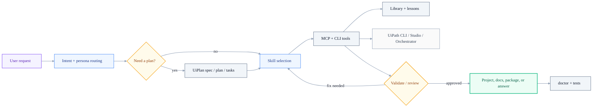
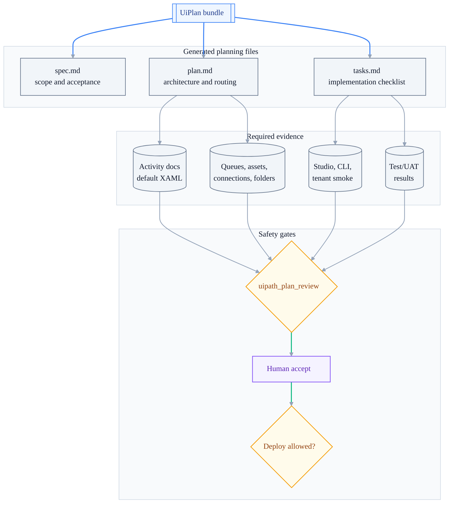
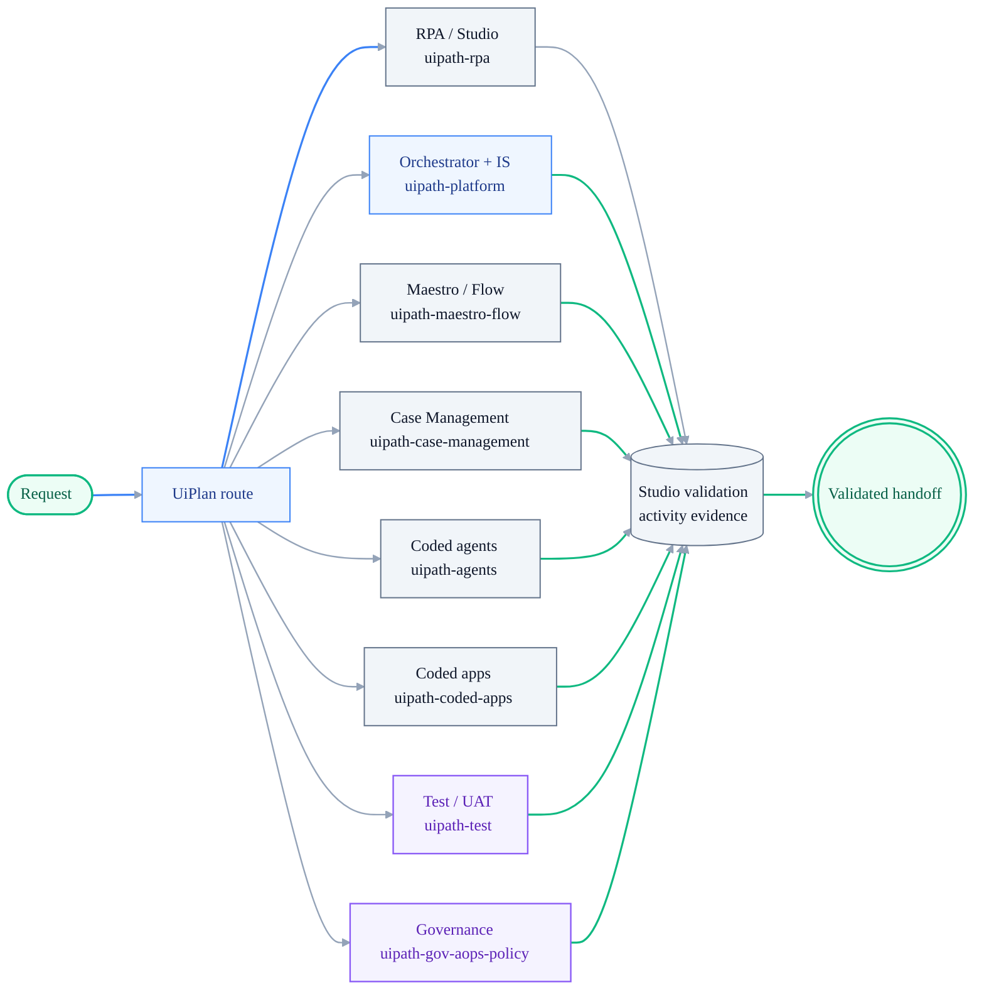
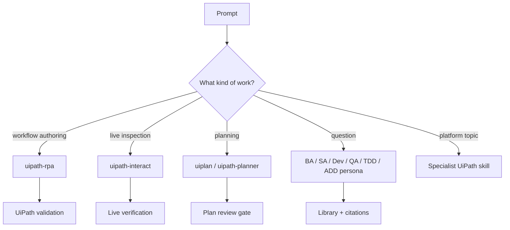
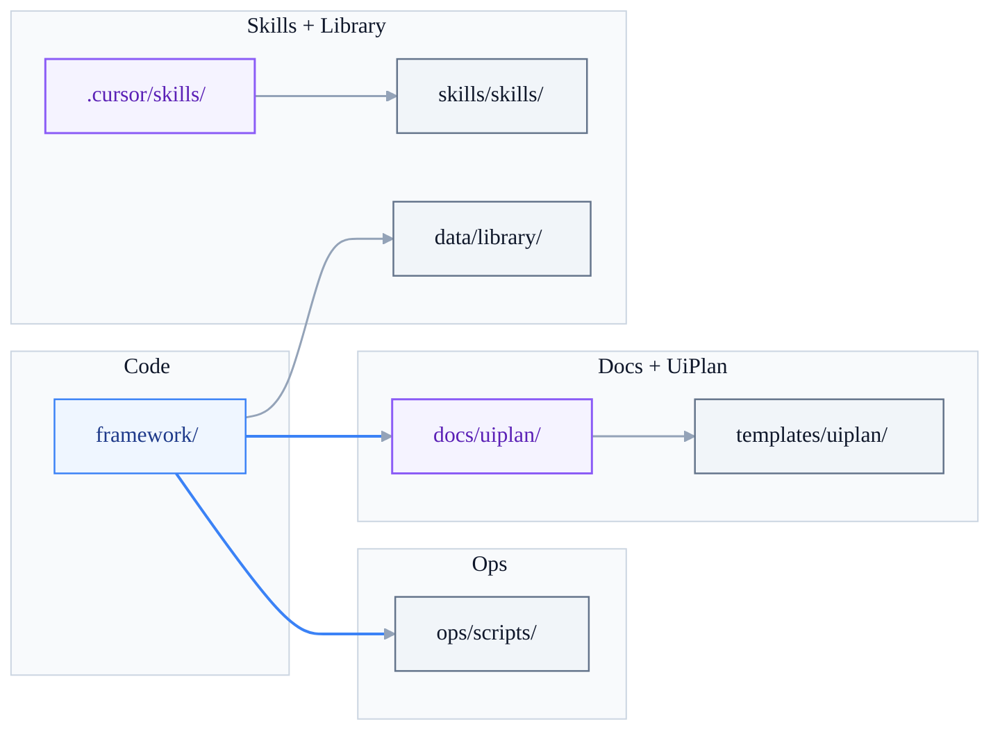
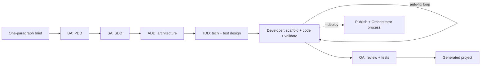

# UiPath Builder Agent

**An agentic UiPath delivery workspace for Cursor, Claude Code-style CLI workflows, MCP tools, UiPlan planning, validation loops, and library learning.**


UiPath Builder Agent is a practical build operating system for UiPath work. It helps you plan the work, select the right skill, scaffold projects, generate or edit automations, validate with UiPath tooling, learn from failures, and keep humans in control before destructive actions such as publish or deploy.

It works three ways:

| Path | Best For | Start Here |
| --- | --- | --- |
| **Cursor + MCP** | Best IDE experience: skills, validation, library lookup, UiPlan, tool calls | [docs/CURSOR_USER_GUIDE.md](docs/CURSOR_USER_GUIDE.md) |
| **CLI / Claude Code-style terminal** | Headless or terminal-first `uipath-claude` with slash commands | [docs/CLAUDE_USER_GUIDE.md](docs/CLAUDE_USER_GUIDE.md) |
| **Pure Anthropic Claude Code** | Official `claude` CLI in the repo, skills as files, optional MCP; no `uipath-claude chat` | [docs/PURE_CLAUDE_CODE.md](docs/PURE_CLAUDE_CODE.md) |
| **Visual skill map** | See how every skill family, MCP family, Cursor flow, and Claude flow fits together | [docs/SKILL_VISUAL_GUIDE.md](docs/SKILL_VISUAL_GUIDE.md) |
| **Library + planning stack** | Grounded answers, reusable lessons, spec/plan/tasks before execution | [docs/LIBRARY_LEARNING.md](docs/LIBRARY_LEARNING.md), [docs/uiplan/README.md](docs/uiplan/README.md) |

Hero terminal cast: source is [docs/assets/demo.tape](docs/assets/demo.tape); render `docs/assets/demo.gif` with [ops/scripts/record-demo.ps1](ops/scripts/record-demo.ps1) (see [docs/assets/README.md](docs/assets/README.md)).

## What This Project Gives You

This repo brings the main pieces of UiPath assistant work into one local workspace:

- **Workflow authoring** with `uipath-rpa` for XAML and coded RPA projects.
- **Live UI interaction** with `uipath-interact` for screenshots, inspection, click/type actions, and post-build verification.
- **UiPlan planning** with `spec.md`, `plan.md`, and `tasks.md` before risky changes, including paradigm-aware code structure and feasibility gates.
- **MCP tools for Cursor** covering workflow, skill, library, intent, doc, design, memory, answer, plan, and read-only **assistant** orchestration (`uipath_assistant_context` / `uipath_assistant_route`, same routing core as `uipath-claude` chat for natural language).
- **Formal SDLC flow** through `/pdd`: BA -> SA -> ADD -> TDD -> Dev -> QA, with optional publish/deploy gates.
- **Library learning loop** so durable lessons are proposed, reviewed, approved, and reused.
- **Doctor checks** with `uipath-claude doctor` for skills, Cursor setup, MCP docs, `uip`, markdown encoding, and library health.
- **Safety controls** for plan approval, tool profiles, session gates, and Orchestrator deployment boundaries.

If you are onboarding, think of this repo as the place where the assistant learns how to safely move from **idea -> plan -> build -> validate -> handoff**.



---

## Community Readiness

This project is ready to share with community members as a **preview / reference
workspace**, not as a polished one-click product.

Share it if the audience is comfortable with Cursor, Python environments, UiPath
Studio/Automation Cloud, and CLI-driven validation. The strongest parts are the
UiPlan planning flow, specialist skill routing, MCP tool contracts, activity-first
RPA guidance, and runtime evidence gates.

Be explicit about these current caveats:

- Some capabilities depend on local UiPath Studio, Automation Cloud permissions,
  Integration Service connections, or Orchestrator folders that the repo cannot
  create for every user.
- Tenant deploy, connector OAuth, Test Manager execution, and Production promotion
  require human setup and approval.
- The `skills/` submodule is the upstream source of truth for specialist skills.
  Do not edit it directly unless you are intentionally reviewing/updating the
  pinned submodule.
- Treat generated UiPlan files as drafts until review passes and a human accepts
  the scope.

Recommended community framing:

1. Start with `docs/uiplan/HOW_TO_USE.md`.
2. Run local tests before demos: `uv run pytest framework/tests/uiplan framework/tests/mcp_tests/test_uiplan_review.py -q`.
3. For RPA examples, show the InvoiceProcessor runtime fixture and explain that
   it uses pre-built activities first, not `InvokeCode`.
4. Do not promise unattended tenant deployment unless the user has configured
   Automation Cloud credentials, folders, resources, and connector connections.

## Using UiPlan By Domain

UiPlan is the core operating model in this repo. It is the shared planning
contract that turns a request into three reviewable files:

- `spec.md`: business scope, user stories, acceptance criteria, visuals, and
  build visibility.
- `plan.md`: architecture, project topology, domain routing, activity/resource
  choices, and verification strategy.
- `tasks.md`: executable build steps, evidence paths, validation commands, and
  handoff blockers.

The flow is always:

```text
ground -> spec -> plan -> tasks -> review -> accept -> implement
```

### UiPlan Lifecycle

```mermaid
%%{init: {'theme':'base','themeVariables':{'primaryColor':'#E2E8F0','primaryTextColor':'#0F172A','primaryBorderColor':'#94A3B8','lineColor':'#94A3B8','secondaryColor':'#F1F5F9','tertiaryColor':'#F8FAFC','background':'#FFFFFF','clusterBkg':'#F8FAFC','clusterBorder':'#CBD5E1','titleColor':'#0F172A','edgeLabelBackground':'#FFFFFF','fontFamily':'Inter, ui-sans-serif, system-ui'}}}%%
flowchart LR
  Request([User request]):::start --> Ground[Ground context<br/>docs, repo, skill route]:::service
  Ground --> Spec[spec.md<br/>business + visibility]:::process
  Spec --> Plan[plan.md<br/>architecture + evidence design]:::process
  Plan --> Tasks[tasks.md<br/>ordered build steps]:::process
  Tasks --> Review{Review passes?}:::decision
  Review -- No --> Fix[Fix gaps<br/>scope, diagrams, evidence]:::error
  Fix --> Spec
  Review -- Yes --> Accept[Human accepts scope]:::human
  Accept --> Implement[Implement from tasks]:::service
  Implement --> Validate{Runtime evidence?}:::decision
  Validate -- Missing --> Blocker[Structured blocker<br/>or rerun validation]:::error
  Blocker --> Implement
  Validate -- Complete --> Handoff(((Handoff))):::endOk

  classDef start fill:#ECFDF5,stroke:#10B981,color:#065F46,stroke-width:2px
  classDef endOk fill:#ECFDF5,stroke:#10B981,color:#065F46,stroke-width:2px
  classDef process fill:#F1F5F9,stroke:#64748B,color:#0F172A,stroke-width:1.25px
  classDef service fill:#EFF6FF,stroke:#3B82F6,color:#1E3A8A,stroke-width:1.25px
  classDef decision fill:#FFFBEB,stroke:#F59E0B,color:#92400E,stroke-width:1.5px
  classDef human fill:#F5F3FF,stroke:#8B5CF6,color:#5B21B6,stroke-width:1.5px
  classDef error fill:#FEF2F2,stroke:#EF4444,color:#991B1B,stroke-width:1.5px

  linkStyle default stroke:#94A3B8,stroke-width:1.5px
  linkStyle 0,1,2,3 stroke:#3B82F6,stroke-width:2px
  linkStyle 5,8 stroke:#10B981,stroke-width:2px
  linkStyle 4,6,10 stroke:#EF4444,stroke-width:2px
```



Use these surfaces:

- Cursor: `/uiplan-ground`, `/uiplan-spec`, `/uiplan-plan`,
  `/uiplan-tasks`, `/uiplan-review`, `/uiplan-implement`
- MCP: `uipath_plan_ground`, `uipath_plan_spec_new`,
  `uipath_plan_plan_new`, `uipath_plan_tasks_new`, `uipath_plan_review`,
  `uipath_plan_accept`
- CLI: `uipath-claude plan uiplan ground|spec|plan|tasks|review|accept`

### What UiPlan Builds



### Domain Routing



Domain guidance:

- **RPA / Studio workflows (`.xaml`)**
  - Route to `uipath-rpa`.
  - Prefer pre-built UiPath activities. Use `InvokeCode` only as a justified
    fallback after activity lookup fails.
  - Required evidence: activity docs/default XAML, `uip rpa get-errors`,
    `uip rpa build`, `uipcli package analyze`, and a safe local or tenant smoke.

- **Orchestrator resources and deployment**
  - Route to `uipath-platform`.
  - Plan queues, assets, folders, triggers, processes, and bindings explicitly.
  - Required evidence: provisioning command, existence verification, target
    folder, package/process version, job id, final state, and logs. If tenant
    access is unavailable, record a structured blocker instead of claiming done.

- **Integration Service connectors**
  - Route to `uipath-platform` for connection/resource setup and the relevant
    build skill for runtime usage.
  - Create or verify connections with `uip is connectors ...` and
    `uip is connections ...`; connector OAuth remains a human/browser step when
    required.
  - Required evidence: connector key, connection name/id, environment, secret
    boundary, ping/test-call result, and runtime activity or SDK usage.

- **Maestro / Flow**
  - Route to `uipath-maestro-flow`.
  - Plan `.flow` artifacts, triggers, BPMN/process steps, connector mappings,
    HITL nodes, and solution packaging boundaries.
  - Required evidence: flow debug/run output where safe, connector/resource
    bindings, solution pack/analyze evidence, and tenant blocker if cloud access
    is unavailable.

- **Case Management**
  - Route to `uipath-case-management`.
  - Start from the SDD or process description, then generate tasks that build
    `caseplan.json`, task definitions, statuses, SLAs, roles, and data mappings.
  - Required evidence: generated case artifacts, CLI validation/build output,
    role/resource mapping, and tenant setup blocker or deployment evidence.

- **Coded agents**
  - Route to `uipath-agents`.
  - Plan `langgraph.json`, `agent_framework.json`, `pyproject.toml`, graph nodes,
    tools, eval data, and runtime bindings.
  - Required evidence: `pytest`, local `uipath run`, optional `uipath eval`,
    pack/publish blocker or deployment evidence, and connector/tool binding
    proof.

- **Coded apps and action apps**
  - Route to `uipath-coded-apps`.
  - Plan `app.config.json`, `action-schema.json`, TypeScript entry points,
    user-facing flows, and solution packaging.
  - Required evidence: local build, type check/test output, action schema review,
    solution packaging evidence, and tenant deployment blocker or smoke result.

- **Testing / UAT**
  - Route to `uipath-test` for Test Manager/test execution and to the build skill
    for test automation artifacts.
  - Plan test cases alongside implementation tasks, not after the fact.
  - Required evidence: test artifact path, acceptance-criteria mapping, execution
    command such as `uipcli test run`, result file, and log/output assertions.

- **Governance / AOps policy**
  - Route to `uipath-gov-aops-policy`.
  - Plan policy intent, target users/groups/tenants, enforcement mode, and
    rollback/handoff.
  - Required evidence: generated policy JSON, validation output, deployment target,
    and explicit human approval before tenant-wide changes.

For all domains, use `docs/uiplan/ACTIVITY_AND_RUNTIME_EVIDENCE.md` as the
evidence checklist. A UiPlan is not implementation-ready until
`uipath_plan_review` has no error-severity findings and the user accepts the
bundle.

## Capability Map

| Area | What It Gives You | Primary Files |
| --- | --- | --- |
| **Assistant runtime** | Intent routing, personas, slash commands, tool profiles, validation loop | [framework/uipath_claude/](framework/uipath_claude/) |
| **Cursor MCP server** | UiPath workflow, plan, library, skill, answer, doc, and memory tools | [framework/mcp_server/](framework/mcp_server/), [docs/MCP_TOOLS.md](docs/MCP_TOOLS.md) |
| **Cursor skills** | IDE-native playbooks and routing hints generated from upstream plus overlays | [.cursor/skills/](.cursor/skills/), [skills/skills/](skills/skills/), [extensions/skills/](extensions/skills/) |
| **UiPlan** | `spec.md` + `plan.md` + `tasks.md` planning contract | [docs/uiplan/](docs/uiplan/), [templates/uiplan/](templates/uiplan/) |
| **Library learning** | Reviewed lessons, citations, proposals, audit trail | [docs/LIBRARY_LEARNING.md](docs/LIBRARY_LEARNING.md), [data/library/](data/library/) |
| **Operations scripts** | Cursor setup, Claude setup, MCP docs generation, skill updates | [ops/scripts/](ops/scripts/) |
| **Capability contract** | Canonical CLI/Cursor/MCP surface and explicit Claude Code non-goals | [docs/CAPABILITY_CONTRACT.md](docs/CAPABILITY_CONTRACT.md) |

## Current Skill Routing

Use this as the mental model for both Cursor and the CLI:

| If the user asks to... | Prefer | Notes |
| --- | --- | --- |
| Build, edit, validate, or explain a UiPath workflow/project | `uipath-rpa` | Canonical authoring path for XAML, coded RPA, selectors, packages, project structure. |
| Inspect a live browser/desktop app, take screenshots, click/type, read screen state | `uipath-interact` | Canonical live interaction path. `uipath-servo` is legacy alias/redirect only. |
| Plan a feature or implementation before edits | `uiplan` / `uipath-planner` | Use UiPlan for structured `spec.md`, `plan.md`, `tasks.md`; planner for lighter routing. |
| Ask platform, Orchestrator, Maestro, HITL, agents, testing, diagnostics, feedback questions | Matching specialist skill | See [docs/CURSOR_USER_GUIDE.md](docs/CURSOR_USER_GUIDE.md#skill-selection-cheat-sheet). |
| Need grounded project knowledge | Library + MCP answer tools | Search reviewed library material before inventing answers. |



---

## Repository Layout (Runtime Code)

Python packages and the MCP server live under **`framework/`**. Operations scripts are under **`ops/scripts/`**. UiPlan **template kit** ships under **`templates/uiplan/`**; human guidance lives under **`docs/uiplan/`**.



### Tests and Orchestrator runbooks

- **Fast test path:** `pytest -m "not integration"` from repo root; see [docs/TESTING.md](docs/TESTING.md) for the full matrix and markers.
- **MCP regression tests** live under **`framework/tests/mcp_tests/`**. Do not add a `framework/tests/mcp` package: it shadows the PyPI **`mcp`** dependency (`mcp.types`, etc.) and breaks MCP server imports under pytest.
- **Generated tool catalog:** when you add or change MCP tools, run `python ops/scripts/generate_mcp_tools_doc.py` and commit [docs/MCP_TOOLS.md](docs/MCP_TOOLS.md).
- **Studio/RPA validation:** before any RPA project is called done, validate edited `.xaml` files with `uip rpa get-errors --studio-dir ...`, run `uip rpa build --project-path ... --studio-dir ...`, then run `uipcli package analyze`. Orchestrator smoke proves runtime behavior, but it does not replace Studio Designer validation.
- **Orchestrator packaging / deploy** (compatibility preflight, personal workspace vs shared folders, assistant-session boundaries): **[docs/ORCHESTRATOR_DEPLOYMENT.md](docs/ORCHESTRATOR_DEPLOYMENT.md)**. `uipath_workflow_deploy` / `uipath_workflow_publish` tool text matches that runbook.

---

## Quickstart

### Fast setup scripts

If you just want the happy path, start here:

```powershell
# Cursor + MCP path
.\ops\scripts\cursor-quickstart.ps1

# CLI / Claude Code-style path
.\ops\scripts\claude-quickstart.ps1
```

```bash
# Cursor + MCP path
bash ops/scripts/cursor-quickstart.sh

# CLI / Claude Code-style path
bash ops/scripts/claude-quickstart.sh
```

Then run:

```powershell
uipath-claude doctor
```

`doctor` is read-only. It checks the skills submodule, Cursor skill alignment, `uipath-interact`, legacy Servo aliasing, MCP config/launch/docs, `uip` on PATH, markdown mojibake, runtime imports, and library proposal health.

### 1. Clone the repo (fresh setup)

```bash
git clone <your-repo-url>
cd uipath-builder-agent
git submodule update --init --recursive
```

The submodule step is required: the official UiPath skills ship under `skills/skills/` as a git submodule.

### 2. Create a virtual environment

```powershell
# Windows PowerShell
python -m venv .venv
.\.venv\Scripts\Activate.ps1
```

```bash
# macOS / Linux
python -m venv .venv
source .venv/bin/activate
```

### 3. Install Python dependencies

Pick the extra that matches how you plan to use the project:

| Usage mode             | Install command            |
| ---------------------- | -------------------------- |
| CLI / development      | `pip install -e ".[dev]"`  |
| Cursor + MCP server    | `pip install -e ".[mcp]"`  |
| Both (contributors)    | `pip install -e ".[dev,mcp]"` |

### 4. Run the doctor

```bash
uipath-claude doctor
```

Fix any `FAIL` rows before demos or long-running work. `WARN` rows usually mean "good to clean up soon", not "blocked".

### 5. Verify Bedrock access and run

```bash
aws sts get-caller-identity   # confirm Bedrock creds
uipath-claude chat
```

Full setup (UiPath CLI, Studio 26.2+, Orchestrator auth, AWS region overrides) lives in [docs/INSTALL.md](docs/INSTALL.md).

### How to use everything (at a glance)

| Goal | Best entry point | Why |
| --- | --- | --- |
| Understand project purpose and architecture | [README.md](README.md) + [docs/ARCHITECTURE.md](docs/ARCHITECTURE.md) | Fast orientation + deep runtime model |
| Plan a meaningful change before code | [docs/uiplan/README.md](docs/uiplan/README.md) + `/uiplan-*` (or `/uiplan` dispatcher) | Structured spec/plan/tasks with review gates |
| Run full SDLC lifecycle | `/pdd` + [docs/PDD_LIFECYCLE.md](docs/PDD_LIFECYCLE.md) | BA -> SA -> ADD -> TDD -> Dev -> QA flow |
| Work primarily in Cursor | [docs/CURSOR_USER_GUIDE.md](docs/CURSOR_USER_GUIDE.md) | Skills + MCP tooling + quickstart path |
| Work primarily in CLI (terminal / Claude Code) | [docs/CLAUDE_USER_GUIDE.md](docs/CLAUDE_USER_GUIDE.md) | Setup, hooks, slash-first workflow |
| Understand how every skill works visually | [docs/SKILL_VISUAL_GUIDE.md](docs/SKILL_VISUAL_GUIDE.md) | Skill families, routing, Cursor flow, Claude flow, MCP families |
| Learn the recommended day-to-day usage patterns | [docs/CURSOR_USER_GUIDE.md](docs/CURSOR_USER_GUIDE.md#mcp-tools-advanced) + [docs/CLAUDE_USER_GUIDE.md](docs/CLAUDE_USER_GUIDE.md#best-practices-for-claude--terminal-work) | Cursor MCP playbooks, prompt shape, safety rules, CLI preflight, plans, validation |
| CLI reference (commands, env, cookbook) | [docs/USER_GUIDE.md](docs/USER_GUIDE.md) | Deeper command and env documentation |
| Understand supported Claude-Code-style parity | [docs/CAPABILITY_CONTRACT.md](docs/CAPABILITY_CONTRACT.md) | Canonical CLI/Cursor/MCP contract and non-goals |
| Learn from accepted fixes and proposals | [docs/LIBRARY_LEARNING.md](docs/LIBRARY_LEARNING.md) | Operator workflow for proposal review and audit logs |
| Inspect available MCP tools | [docs/MCP_TOOLS.md](docs/MCP_TOOLS.md) | Generated catalog of Cursor-callable tools |
| Validate functionality | [docs/TESTING.md](docs/TESTING.md) + [docs/SMOKE_TESTS.md](docs/SMOKE_TESTS.md) | Automated gates plus scenario smoke tests |

---

## Choose your setup path

Four supported ways to use the project. Pick one primary mode per clone.

For cleaner onboarding and fewer collisions, this repo now recommends **one assistant per clone**:

- Cursor path writes `.assistant-choice = cursor`
- Claude path writes `.assistant-choice = claude`
- Switching tools in the same clone requires `-Force` / `--force`

### A. CLI (`uipath-claude chat`) — Claude Code-style agent

The full agentic CLI with auto-fix loop, planner, and BA -> SA -> ADD -> TDD -> Dev -> QA pipeline driven by `/pdd`.

- Requires `pip install -e ".[dev]"` and AWS Bedrock access.
- Fast path: `ops/scripts/claude-quickstart.ps1` (Windows) or `bash ops/scripts/claude-quickstart.sh`.
- Run: `uipath-claude chat`
- Terminal guide: [docs/CLAUDE_USER_GUIDE.md](docs/CLAUDE_USER_GUIDE.md); command reference: [docs/USER_GUIDE.md](docs/USER_GUIDE.md)

### B. Pure Claude Code (`claude`) — no custom chat runtime

Use Anthropic's normal Claude Code CLI directly in this repo. Claude Code reads
`CLAUDE.md`, docs, and skill files as project context, but Cursor-native slash
commands are not shown automatically.

```powershell
git pull origin main
git submodule update --init --recursive
uv sync --extra dev
claude
```

Inside Claude Code, ask it to read the relevant contract explicitly, for example:
`Read CLAUDE.md, then use .cursor/skills/uiplan/SKILL.md for UiPlan work.`

Guide: [docs/PURE_CLAUDE_CODE.md](docs/PURE_CLAUDE_CODE.md).

### C. Cursor (skills-only)

Use the UiPath skills directly inside Cursor without the CLI runtime. Good for quick scaffolding and design questions.

```powershell
# Windows
.\ops\scripts\cursor-quickstart.ps1
```

```bash
# macOS / Linux
bash ops/scripts/cursor-quickstart.sh
```

Open the repo in Cursor; skills auto-load. Guide: [docs/CURSOR_USER_GUIDE.md](docs/CURSOR_USER_GUIDE.md).

### D. Cursor + MCP (skills + UiPath tool calls)

Adds validation, package install, and run-workflow tools to Cursor via the bundled MCP server.

- Install MCP extras: `pip install -e ".[mcp]"`.
- Run `ops/scripts/setup-cursor.ps1` / `.sh` (writes `.cursor/mcp.json`).
- Open the repo in Cursor — the `uipath-builder-agent` MCP server auto-connects.
- Verify in Cursor: Settings -> MCP -> `uipath-builder-agent` shows connected.
- MCP tool reference and patterns: [docs/CURSOR_USER_GUIDE.md](docs/CURSOR_USER_GUIDE.md#mcp-tools-advanced).

---

## What it does

- **Generate validated UiPath projects from a description.** Describe the automation in plain English; the agent scaffolds the project, writes XAML, runs the UiPath Workflow Analyzer and `uip rpa` validator, and auto-fixes validator errors until the workflow passes both static and runtime checks.
- **Separates authoring from live interaction.** Use `uipath-rpa` for project/workflow authoring and `uipath-interact` for screenshots, live browser/desktop inspection, click/type actions, and verification after a build.
- **Bootstrap end-to-end with the BA → SA → ADD → TDD → Dev → QA pipeline.** `/pdd "InvoiceBot"` turns a one-paragraph brief into a PDD, SDD, ADD, TDD, scaffolded project, validated workflow, and (optionally) a published + deployed Orchestrator process. The legacy four-stage `/bootstrap` flow is still available for quick BA → SA → Dev → QA runs. Full reference: [docs/PDD_LIFECYCLE.md](docs/PDD_LIFECYCLE.md).
- **Works where you work.** Use the CLI (`uipath-claude chat`), drive it from Cursor (the skills register automatically after running `ops/scripts/setup-cursor.ps1`), or call slash commands like `/pdd`, `/bootstrap`, `/skills`, `/analyze`, `/recall`.
- **Answers from reviewed knowledge.** MCP answer and library tools search approved project knowledge, citations, and durable lessons before improvising.
- **Learns as you use it.** A layered skills system (user → project → team extensions → official UiPath submodule) plus a library learning loop capture gotchas and edge cases as you hit them, so the agent gets better at your codebase over time.
- **Self-checks the workspace.** `uipath-claude doctor` gives a grouped status report for skills, Cursor, MCP docs, markdown hygiene, runtime imports, `uip`, and library health.
- **Safe by default.** Tool profiles (`safe`, `uipath-dev`, `all`), per-operation approval gates, and session hooks keep destructive actions behind human review. Orchestrator publish/deploy follows [docs/ORCHESTRATOR_DEPLOYMENT.md](docs/ORCHESTRATOR_DEPLOYMENT.md); nothing targets shared or Production folders without explicit human confirmation.

## Health Check Before You Open Cursor

Run this from the repository root after pulling `main`, switching branches, or updating the skills submodule:

```powershell
git submodule update --init --recursive
uv sync --extra dev --extra mcp
uipath-claude doctor
```

Cursor users can then open Settings -> MCP and confirm `uipath-builder-agent` is connected. If generated MCP docs are stale, run:

```powershell
python ops/scripts/generate_mcp_tools_doc.py
```

The generated output should leave [docs/MCP_TOOLS.md](docs/MCP_TOOLS.md) unchanged unless the tool surface really changed.

---

## SDLC planning (quick pointer)

For non-trivial changes, use UiPlan as the default planning contract:
`spec.md` -> `plan.md` -> `tasks.md` with review and acceptance gates before build.

Primary references:

- [docs/uiplan/README.md](docs/uiplan/README.md) — canonical onboarding (what to use where)
- [docs/uiplan/HOW_TO_USE.md](docs/uiplan/HOW_TO_USE.md) — operational command flow
- [docs/uiplan/TASK_AUTHORING.md](docs/uiplan/TASK_AUTHORING.md) — advanced execution contract
- [docs/PLANNING_FRAMEWORK.md](docs/PLANNING_FRAMEWORK.md) — broader planning framework and legacy paths

Default execution path:

1. Generate/refine UiPlan bundle.
2. Run review until no error findings.
3. Accept the bundle.
4. Implement from accepted tasks.

Legacy single-file planning (`uipath_plan_new/refine/diff`) remains available but is non-default for UiPlan work.

---

## A real example

A session driving the auto-fix loop against a real validator error. The full transcript lives in [examples/03-auto-fix-validator/](examples/03-auto-fix-validator/).

```text
> Build me an InvoiceProcessor workflow that reads Sample.xlsx and logs each invoice id.

[Step 1/25] ensure_project_structure(name="InvoiceProcessor")
   -> created InvoiceProcessor/project.json, Main.xaml
[Step 2/25] install_package("UiPath.Excel.Activities")
   -> ok
[Step 3/25] write_file("InvoiceProcessor/Main.xaml", ...)
[Step 4/25] validate_file("InvoiceProcessor/Main.xaml")
   -> ERRORS (2):
      - UiPath.Excel.Activities.ExcelReadRange: 'Range' is required
      - Variable 'dt_Invoices' used before assignment
[Step 5/25] validate_and_fix_loop -> patching...
[Step 6/25] write_file("InvoiceProcessor/Main.xaml", ...)   # revised
[Step 7/25] validate_file("InvoiceProcessor/Main.xaml")
   -> OK (0 errors, 0 warnings)
[Step 8/25] run_workflow("InvoiceProcessor")
   -> OK: processed 14 invoices in 1.2s

Done. Generated at generated/chat/2026-04-18-0a1b/InvoiceProcessor/.
```

What just happened: the model wrote XAML, the UiPath validator rejected it, `validate_and_fix_loop` interpreted the errors, rewrote the file, and only stopped when both the static validator and the runtime `uip rpa run-file` agreed.

---

## Architecture

The chat runtime loads a **skill registry** from several filesystem layers (user, project, team extensions, official UiPath submodule) and exposes them to a ReAct-style executor alongside UiPath tools (CLI, Analyzer, Orchestrator, Ask AI). A validator gate sits inline in the loop: every `write_file` is followed by `validate_file`, and failures feed back into the executor until the workflow passes. Plan mode wraps the executor with a read-only proposal step so you approve the plan before any file is touched.



The new six-agent flow is driven by the `/pdd` slash command and is documented in [docs/PDD_LIFECYCLE.md](docs/PDD_LIFECYCLE.md). The legacy `/bootstrap` BA → SA → Dev → QA flow is still wired in for short runs (see [docs/ARCHITECTURE.md](docs/ARCHITECTURE.md)).

Deeper technical detail: [docs/ARCHITECTURE.md](docs/ARCHITECTURE.md).

---

## Docs

- [docs/README.md](docs/README.md) — index of every document in this repo
- [docs/INSTALL.md](docs/INSTALL.md) — full installation (UiPath CLI, Studio, submodules, AWS)
- [docs/ARCHITECTURE.md](docs/ARCHITECTURE.md) — runtime, executor, validator gate, pipeline
- [docs/CLAUDE_USER_GUIDE.md](docs/CLAUDE_USER_GUIDE.md) — Claude / terminal setup and workflow
- [docs/USER_GUIDE.md](docs/USER_GUIDE.md) — day-to-day CLI usage (commands, env vars)
- [docs/SKILL_VISUAL_GUIDE.md](docs/SKILL_VISUAL_GUIDE.md) — visual guide to skill families, routing, Cursor, Claude, and MCP tools
- [docs/PDD_LIFECYCLE.md](docs/PDD_LIFECYCLE.md) — full `/pdd` lifecycle: BA → SA → ADD → TDD → Dev → QA → publish → deploy
- [docs/PLANNING_FRAMEWORK.md](docs/PLANNING_FRAMEWORK.md) — brainstorm-to-plan loop (`uipath_plan_*`, `UIPATH_PLAN_GATE`, draft vs published)
- [docs/CURSOR_USER_GUIDE.md](docs/CURSOR_USER_GUIDE.md) — using the skills inside Cursor
- [docs/TOOLS.md](docs/TOOLS.md) — tool registry reference
- [docs/SKILL_LAYOUT.md](docs/SKILL_LAYOUT.md) — skill layering and provenance
- [docs/LIBRARY_LEARNING.md](docs/LIBRARY_LEARNING.md) — library learning loop
- [docs/SMOKE_TESTS.md](docs/SMOKE_TESTS.md) — end-to-end smoke scenarios
- [CONTRIBUTING.md](CONTRIBUTING.md) — how to add skills, tools, and slash commands
- [CHANGELOG.md](CHANGELOG.md) — release history

---

## Keeping skills up to date

The `skills/` git submodule tracks [UiPath/skills](https://github.com/UiPath/skills). Official skills live in `skills/skills/`; Cursor-facing entries live under `.cursor/skills/` and may include local overlays or compatibility redirects. The canonical live-interaction skill is `uipath-interact`; `uipath-servo` should remain only as a legacy redirect/alias. Run `uipath-claude doctor` after submodule bumps to catch drift.

Paths to stay current:

- **Automatic (per Cursor session, throttled):** [.cursor/hooks.json](.cursor/hooks.json) registers a `sessionStart` hook that runs [.cursor/hooks/check-skills-update.ps1](.cursor/hooks/check-skills-update.ps1) on Windows (or `.sh` on mac/linux). It surfaces a banner in the new chat when updates are available; throttled via `.cursor/hooks/state/last-update-check` (gitignored, per-user). Change `$ThrottleDays` at the top of the script to tune the cadence. For timed checks outside Cursor, use your OS scheduler calling `ops/scripts/update-skills.ps1 -Check` or enable a minimal GitHub Action when ready.
- **Manual in chat:** `/update-skills [--check|--info|--force]` and `/scan-upstream-skills` inside the CLI.
- **Manual in a shell:** `ops/scripts/update-skills.ps1 [-Check] [-Commit]` (or `ops/scripts/update-skills.sh [--check|--commit]`) for one-off pulls outside Cursor.

> Mac/linux teammates: if `pwsh` is not installed, replace the `command` in `.cursor/hooks.json` with `bash .cursor/hooks/check-skills-update.sh`, or place an override at `~/.cursor/hooks.json` (user-scope hooks take precedence over project-scope).

---

## Contributing

Issues and PRs are welcome. The project is extensible along three axes: **skills**, **tools**, and **slash commands**.

### Quick contributor path

```bash
# 1. Fork and clone, then install dev + MCP extras
pip install -e ".[dev,mcp]"
git submodule update --init --recursive

# 2. Make your change on a feature branch
git checkout -b my-change

# 3. Run the core checks
ruff check .
black --check .
mypy framework/uipath_claude
pytest -m "not integration"

# 4. Open a PR against main
```

### Where to contribute

- **Skills** — markdown playbooks under `extensions/skills/` (team-shared) or `.uipath-claude/skills/` (local). Do not edit the `skills/skills/` submodule in place.
- **Tools** — Python functions under [framework/uipath_claude/tools/](framework/uipath_claude/tools/), registered via tool profiles.
- **Slash commands** — small modules under [framework/uipath_claude/commands/](framework/uipath_claude/commands/) registered on the command registry.
- **Docs** — keep [docs/](docs/) and [CHANGELOG.md](CHANGELOG.md) in sync with user-visible changes.

Full contribution workflow, layering rules, MCP session gate, and review expectations live in [CONTRIBUTING.md](CONTRIBUTING.md).

---

## License

Internal use. See `pyproject.toml`.
