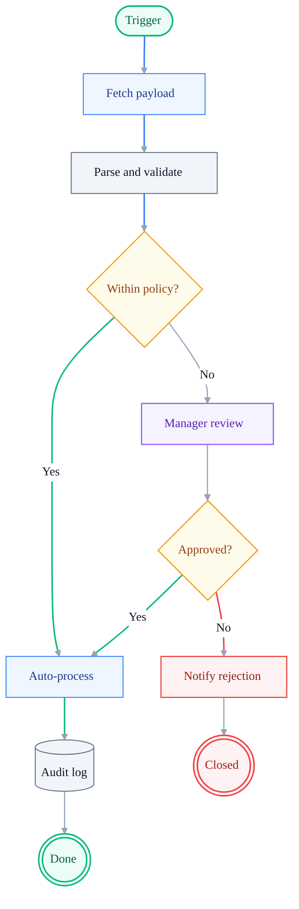
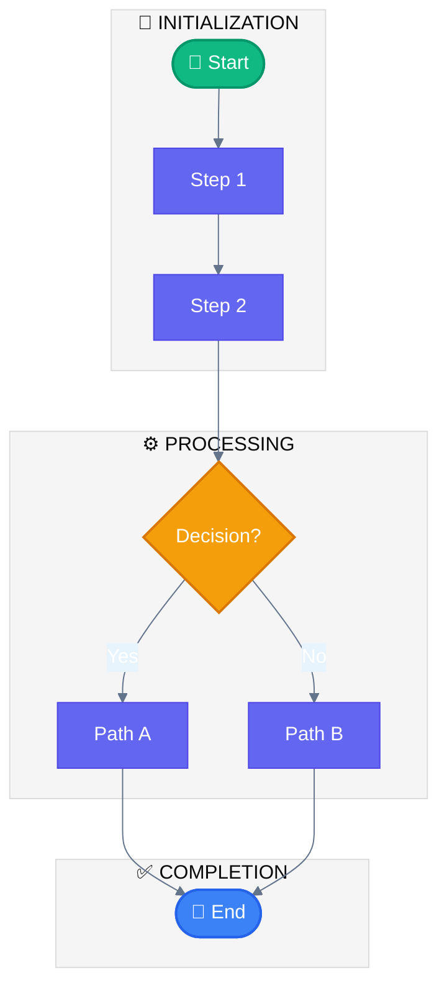
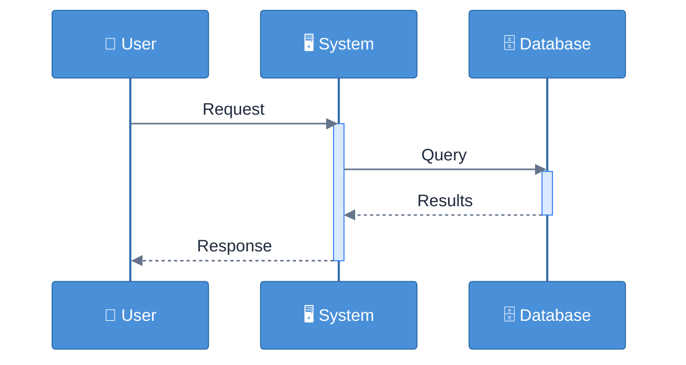
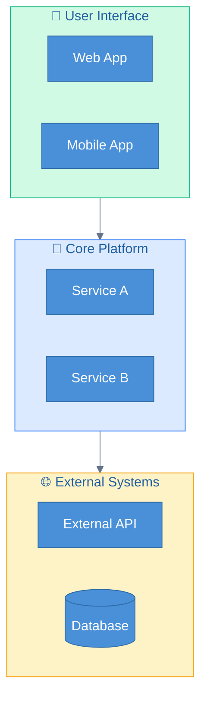
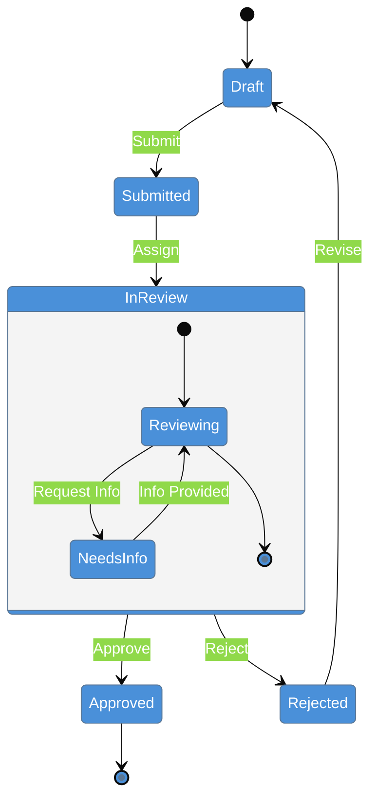
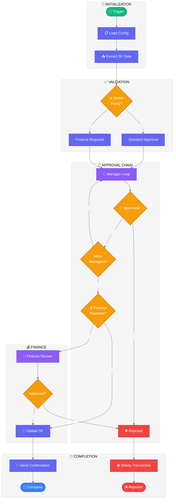
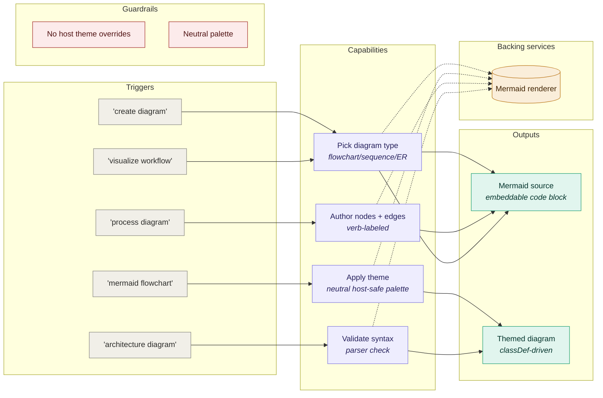

## Repo note (uipath-builder-agent)

Diagrams under `docs/plans/` render in Cursor markdown preview or on GitHub. Sections below that reference `packages/portal/` apply to the UiPath Spec Project Template; here, follow **Pro Standard** (`classDef`, `linkStyle`) and ignore portal-specific paths unless you are working in that codebase.

# Mermaid Diagram Builder

Generate professional, visually appealing Mermaid diagrams with modern color schemes, proper styling, and clear visual hierarchy for technical and business documentation.

## When to Use

- Creating flowcharts for SDDs/PDDs
- Visualizing UiPath workflows
- Generating architecture diagrams
- Creating sequence diagrams for API flows
- Building decision trees
- Documenting approval processes
- Any Mermaid diagram that needs professional styling

## Core Principles

1. **Visual Hierarchy**: Use colors to distinguish between different node types and flows
2. **Readability**: Ensure text is readable with proper contrast
3. **Consistency**: Apply uniform styling across all diagrams in a document
4. **Semantic Colors**: Use colors that convey meaning (green=success, red=error, blue=process)
5. **Calm canvas, loud nodes**: Subgraphs and the page should be near-neutral; only the *nodes* should carry color. Saturated cluster backgrounds make every diagram look "ugly" no matter how nice the node palette is.

## Host Renderer Constraints (READ FIRST)

In this repo Mermaid is rendered by React components that call `mermaid.initialize(...)` themselves (`packages/portal/src/components/pdd/MermaidDiagram.tsx` and `packages/portal/src/components/shared/MarkdownRenderer.tsx`). That has three consequences you must design around:

- **`%%{init}%%` blocks are best-effort.** Some host initializers run before your block is parsed; some Mermaid versions ignore re-init for `themeVariables` keys already set. Treat `%%{init}%%` as a *hint*, not a guarantee.
- **`classDef` is the reliable lever.** Per-node fill / stroke / color set via `classDef` always wins. Use it for every meaningful node — never rely on Mermaid's default `primaryColor` to make a diagram look right.
- **Cluster (subgraph) backgrounds use `secondaryColor` / `tertiaryColor`.** If those are saturated (orange, green, bright purple), every subgraph turns into a loud block and the diagram looks garish. Keep them in the slate-50 / slate-100 range and let nodes carry the palette.

### Required defaults (host init)

The portal initializes Mermaid with these neutral defaults (see `MermaidDiagram.tsx`). Author diagrams assuming this baseline:

```
theme: 'base'
primaryColor:        #E2E8F0   // calm slate, not a brand color
primaryTextColor:    #0F172A
primaryBorderColor:  #94A3B8
lineColor:           #64748B
secondaryColor:      #F1F5F9   // <- subgraph bg, MUST stay near-neutral
tertiaryColor:       #F8FAFC   // <- nested cluster bg, MUST stay near-neutral
clusterBkg:          #F8FAFC
clusterBorder:       #CBD5E1
background:          #FFFFFF
```

If you change those host defaults, update both `MermaidDiagram.tsx` and `MarkdownRenderer.tsx` together — they must agree, otherwise the same markdown renders differently in the PDD viewer vs. the generic doc viewer.

## Pro Standard (canonical look)

Distilled from the Craft "Beautiful Mermaid" gallery ([agents.craft.do/mermaid](https://agents.craft.do/mermaid)), the official Mermaid examples ([mermaid.ai/open-source/syntax/examples](https://mermaid.ai/open-source/syntax/examples.html)), the Mermaid Online template gallery ([mermaidonline.live/templates](https://www.mermaidonline.live/templates)), and the *"Stop using ugly charts"* itnext.io article. **All diagrams in this repo MUST follow this standard.**

### The five rules

1. **Light tinted fill + saturated stroke + dark text.** Saturated fills with white text (the "neon" look) are out. Use `fill: #ECFDF5, stroke: #10B981, color: #065F46` style pairings instead.
2. **Carry meaning in shape, not just color.** `([Stadium])` = event/start/end. `{Diamond}` = decision. `[Rectangle]` = activity. `[(Cylinder)]` = data store. `(((Double circle)))` = terminal/critical end. `[/Parallelogram\]` = input/output. `[[Subroutine]]` = sub-process. Encode semantics with the *shape* so colorblind readers still get the diagram.
3. **Use `linkStyle` to highlight the critical path.** Default edges = muted gray (`#94A3B8`); success path = green (`#10B981`); error/exception = red (`#EF4444`); primary path = blue (`#3B82F6`). Never let every edge fight for attention.
4. **`:::className` shorthand** is preferred over a separate `class A,B,C foo` block at the bottom — it keeps each node's intent local and readable.
5. **Calm canvas, loud nodes.** Subgraph backgrounds stay slate-50/100. Node fills carry the (still-restrained) palette. Subgraph titles in `["Title Case"]`, not `SHOUTING`.

### Canonical palette (use these exact tokens)

| Role | Fill | Stroke | Text | When to use |
| --- | --- | --- | --- | --- |
| `start` | `#ECFDF5` | `#10B981` | `#065F46` | Triggers, process kick-off |
| `success` / `endOk` | `#ECFDF5` | `#10B981` | `#065F46` | Happy-path terminal |
| `process` (default) | `#F1F5F9` | `#64748B` | `#0F172A` | Generic activity / step |
| `service` | `#EFF6FF` | `#3B82F6` | `#1E3A8A` | API call, integration, automated service |
| `data` | `#F1F5F9` | `#64748B` | `#0F172A` | Cylinder data stores `[(...)]` |
| `decision` | `#FFFBEB` | `#F59E0B` | `#92400E` | Diamond gateways `{...}` |
| `human` / HITL | `#F5F3FF` | `#8B5CF6` | `#5B21B6` | User tasks, Action Center, manual |
| `error` / `endFail` | `#FEF2F2` | `#EF4444` | `#991B1B` | Exceptions, rejections |
| `external` | `#FAFAFA` | `#94A3B8` | `#334155` | Out-of-system actors / dashed border |

### Canonical `linkStyle` block

Place once near the bottom of every flowchart:

```
linkStyle default stroke:#94A3B8,stroke-width:1.5px
%% Then, for the specific edges that matter:
%% linkStyle 0,1,2 stroke:#3B82F6,stroke-width:2px   %% primary happy path
%% linkStyle 5     stroke:#10B981,stroke-width:2px   %% success branch
%% linkStyle 7,8   stroke:#EF4444,stroke-width:2px   %% error / rejection
```

### Canonical reference diagram (copy this shape)



### Self-check before saving any diagram

- [ ] Every meaningful node has a class via `:::name` or a `class` statement.
- [ ] Class fills are tinted (50/100 weight), not saturated.
- [ ] Decision diamonds use `decision` class (amber outline, not amber fill).
- [ ] At least one `linkStyle` directive distinguishes primary path / success / error.
- [ ] Subgraph titles are Title Case in `["..."]`, no SHOUTING, no decorative emoji.
- [ ] No inline `style nodeId fill:#...` lines.
- [ ] Reads cleanly in light mode and on the portal's slate background.

If any box is unchecked, rewrite. The legacy themes below are kept for historical reference; **prefer the Pro Standard above for new diagrams**.

## Professional Color Themes (legacy)

### Theme 1: Enterprise Blue (Default for SDDs)

Best for: Technical documentation, system architecture, process flows.

**Color philosophy:** the *canvas* is slate; the *nodes* carry blue. Do **not** set `primaryColor` to a saturated brand value — Mermaid will tint cluster backgrounds with it.

```mermaid
%%{init: {'theme': 'base', 'themeVariables': {
  'primaryColor': '#E2E8F0',
  'primaryTextColor': '#0F172A',
  'primaryBorderColor': '#94A3B8',
  'lineColor': '#64748B',
  'secondaryColor': '#F1F5F9',
  'tertiaryColor': '#F8FAFC',
  'background': '#FFFFFF',
  'mainBkg': '#E2E8F0',
  'nodeBorder': '#94A3B8',
  'clusterBkg': '#F8FAFC',
  'clusterBorder': '#CBD5E1',
  'titleColor': '#0F172A',
  'edgeLabelBackground': '#FFFFFF'
}}}%%
```

> Brand color (Enterprise Blue `#3B82F6` / `#2563EB`) is then applied **per node** via `classDef processNode` / `serviceNode` — never as `primaryColor`.

**Node Classes:**
```
classDef startNode fill:#10B981,stroke:#059669,color:#fff,stroke-width:2px
classDef endNode fill:#EF4444,stroke:#DC2626,color:#fff,stroke-width:2px
classDef processNode fill:#3B82F6,stroke:#2563EB,color:#fff,stroke-width:1px
classDef decisionNode fill:#F59E0B,stroke:#D97706,color:#fff,stroke-width:2px
classDef userTaskNode fill:#8B5CF6,stroke:#7C3AED,color:#fff,stroke-width:1px
classDef serviceNode fill:#06B6D4,stroke:#0891B2,color:#fff,stroke-width:1px
classDef errorNode fill:#EF4444,stroke:#DC2626,color:#fff,stroke-width:2px
classDef successNode fill:#10B981,stroke:#059669,color:#fff,stroke-width:2px
classDef externalNode fill:#64748B,stroke:#475569,color:#fff,stroke-width:1px
classDef dataNode fill:#F1F5F9,stroke:#94A3B8,color:#334155,stroke-width:1px
```

### Theme 2: Modern Dark (For presentations)

Best for: Presentations, dashboards, modern UI documentation

```mermaid
%%{init: {'theme': 'dark', 'themeVariables': {
  'primaryColor': '#6366F1',
  'primaryTextColor': '#F8FAFC',
  'primaryBorderColor': '#818CF8',
  'lineColor': '#94A3B8',
  'secondaryColor': '#1E293B',
  'tertiaryColor': '#0F172A',
  'background': '#0F172A',
  'mainBkg': '#6366F1',
  'nodeBorder': '#818CF8',
  'clusterBkg': '#1E293B',
  'clusterBorder': '#334155'
}}}%%
```

### Theme 3: Warm Professional (For business docs)

Best for: PDDs, business process documentation, stakeholder presentations.

Same calm-canvas approach as Theme 1 — only the *node* fills shift toward violet/indigo via `classDef`. The init block stays neutral so subgraphs don't turn into purple blocks.

```mermaid
%%{init: {'theme': 'base', 'themeVariables': {
  'primaryColor': '#E2E8F0',
  'primaryTextColor': '#0F172A',
  'primaryBorderColor': '#94A3B8',
  'lineColor': '#6B7280',
  'secondaryColor': '#F5F3FF',
  'tertiaryColor': '#FAFAFA',
  'background': '#FFFFFF',
  'mainBkg': '#E2E8F0',
  'nodeBorder': '#94A3B8',
  'clusterBkg': '#FAFAFA',
  'clusterBorder': '#E5E7EB',
  'titleColor': '#0F172A',
  'edgeLabelBackground': '#FFFFFF'
}}}%%
```

> Brand violet (`#7C3AED` / `#6D28D9`) is applied per node via `classDef processNode` etc., not as `primaryColor`.

## Diagram Types and Templates

### 1. Flowchart (Process Flow)



### 2. Sequence Diagram



### 3. Architecture Diagram



### 4. State Diagram



## UiPath Workflow Diagram Guidelines

When documenting UiPath workflows, follow these conventions:

### Node Types and Colors

| Element | Shape | Color | Example |
|---------|-------|-------|---------|
| Start/Trigger | Stadium `([...])` | Green `#10B981` | `([🚀 Manual Trigger])` |
| End/Complete | Stadium `([...])` | Blue `#3B82F6` | `([🏁 Complete])` |
| Activity/Task | Rectangle `[...]` | Purple `#6366F1` | `[Extract Data]` |
| Decision/If | Diamond `{...}` | Amber `#F59E0B` | `{Approved?}` |
| User Task | Rectangle | Violet `#8B5CF6` | `[👤 User Approval]` |
| Service Task | Rectangle | Cyan `#06B6D4` | `[🔧 API Call]` |
| Error Handler | Rectangle | Red `#EF4444` | `[❌ Handle Error]` |
| Subprocess | Subroutine `[[...]]` | Gray `#64748B` | `[[Process Data]]` |

### Subgraph Naming

Use descriptive names with emojis for visual scanning:
- `🔧 INITIALIZATION` - Setup and config
- `📥 DATA EXTRACTION` - Reading data
- `⚙️ PROCESSING` - Core logic
- `✅ VALIDATION` - Checks and rules
- `📤 OUTPUT` - Results and notifications
- `🔄 LOOP` - Iteration blocks
- `❌ ERROR HANDLING` - Exception flows

### Edge Labels

- Use short, clear labels: `Yes`, `No`, `Success`, `Error`
- For conditional flows, include the condition: `|ACV > 100K|`
- Decision branches: Green for Yes/True, Red for No/False

## Best Practices

### 1. Subgraph Organization

Group related steps into logical subgraphs:
- Maximum 5-7 nodes per subgraph
- Use consistent naming conventions
- Apply subgraph-level styling

### 2. Direction and Flow

- Use `TD` (top-down) for process flows
- Use `LR` (left-right) for timelines and sequences
- Maintain consistent flow direction within subgraphs

### 3. Node Spacing

- Let Mermaid handle automatic spacing
- Use subgraphs to create visual separation
- Avoid crossing edges when possible

### 4. Text Content

- Keep node labels concise (2-4 words)
- Use `<br/>` for multi-line labels
- Include icons/emojis for visual cues

### 5. Class Definitions

Always define classes at the end of the diagram for:
- Consistent styling across nodes
- Easy theme changes
- Maintainable code

## Integration with SDD/PDD Skills

When the **pdd-creation** or **sdd-flow-canvas** skills generate documents:

1. **Read this skill first** for styling guidelines
2. **Apply Theme 1** (Enterprise Blue) for SDDs
3. **Apply Theme 3** (Warm Professional) for PDDs
4. **Include class definitions** in every diagram
5. **Use semantic node colors** based on the reference table

## Example: Complete UiPath Approval Workflow



## Common Mistakes (and what to do instead)

| Symptom | Root cause | Fix |
| --- | --- | --- |
| "Diagrams look ugly / garish" | Subgraph backgrounds inheriting a saturated `primaryColor` / `secondaryColor` | Keep `secondaryColor` and `tertiaryColor` in slate-50/100; carry brand color on **nodes** via `classDef`, never on the canvas. |
| Subgraph titles unreadable on colored bg | `clusterBkg` saturated, `titleColor` left as default white | Use `clusterBkg: #F8FAFC` + `titleColor: #0F172A`. |
| Diagram looks fine in markdown preview but wrong in the portal | Host (`MermaidDiagram.tsx`) called `mermaid.initialize` first; your `%%{init}%%` only partially merged | Don't depend on `%%{init}%%` for critical colors — use `classDef`. Update the host defaults if you really need a global change. |
| Random nodes are bright purple/blue with no obvious reason | Mermaid filled them with `mainBkg` because no `class` was assigned | Assign every meaningful node to a `classDef` (startNode / processNode / decisionNode / userNode / endNode / errorNode). |
| Loud `style xyz fill:#...` lines repeated for each node | Per-node inline `style` instead of classes | Replace all `style N fill:...` with one `classDef` + `class N foo` per group. |
| Two diagrams in the same doc render with different fonts/colors | Two different host components initializing Mermaid with different settings | Keep `MermaidDiagram.tsx` and `MarkdownRenderer.tsx` in sync (same `themeVariables`). |

### Red flags — stop and rewrite

- You set `primaryColor` (or `mainBkg`) to anything more saturated than slate.
- You set `secondaryColor` / `tertiaryColor` to anything other than near-white.
- You used inline `style nodeId fill:#...` instead of `classDef`.
- A diagram has no `classDef` block at the bottom.
- You copy-pasted a theme from this skill but then *also* re-tinted `primaryColor` "to match the brand."

If any of those are true, the diagram will look bad in the portal. Rewrite using **calm canvas + `classDef`-driven node colors**.

## References

For additional diagram patterns and best practices, see:
- `references/color-palettes.md` - Full color palette reference
- `references/diagram-patterns.md` - Common diagram patterns

## Related Skills

- **pdd-creation**: Use this skill's styling when generating PDD diagrams
- **sdd-flow-canvas**: Use this skill's styling when generating SDD diagrams
- **workflow-planning**: Reference diagram conventions when planning workflows

<!-- AUTO-VISUALIZER:BEGIN - generated by ops/scripts/enrich-skills.mjs (do not edit by hand inside markers) -->

## Trigger Phrases

- "create diagram"
- "mermaid flowchart"
- "process diagram"
- "architecture diagram"
- "visualize workflow"

## Workflow Steps

1. **Pick diagram type**
2. **Apply neutral theme**
3. **Author nodes and edges**
4. **Validate syntax**

## Visualization

Per the `agent-skill-visualizer` standard. Capability map answers "what does it do?". Additional views are added when warranted.

### Capability map



<!-- AUTO-VISUALIZER:END -->
